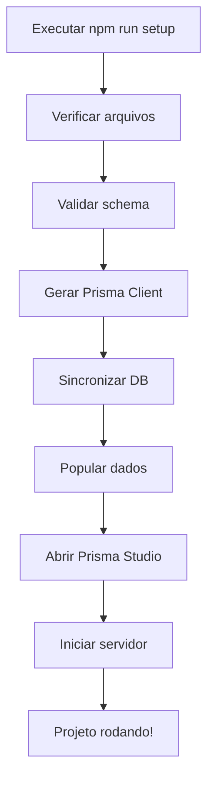

# 🍣 SushiWorld - Guia de Setup Automatizado

Este guia mostra como usar os scripts de automação para configurar e rodar o projeto rapidamente.

---

## 🚀 **Setup Rápido (1 Comando)**

### **Opção 1: Setup Completo (Recomendado)**

Execute o script automatizado que faz tudo pra você:

```powershell
# No PowerShell (Windows)
npm run setup
```

**O que este comando faz:**
1. ✅ Valida o schema do Prisma
2. ✅ Gera o Prisma Client
3. ✅ Sincroniza o banco com Supabase (db push)
4. ✅ Popula dados (produtos do cardápio)
5. ✅ Abre Prisma Studio para verificação
6. ✅ Inicia o servidor em `http://localhost:3000`

---

### **Opção 2: Setup Rápido (sem verificações)**

Se você só quer rodar o servidor rapidamente:

```powershell
npm run setup:quick
```

**Diferença:** Pula o seed e o Prisma Studio.

---

### **Opção 3: Setup sem iniciar servidor**

Para apenas configurar o banco sem rodar o dev server:

```powershell
npm run setup:no-dev
```

---

## 📋 **Comandos Individuais**

Se preferir rodar cada etapa manualmente:

### **1. Validar Schema**

```powershell
npm run db:validate
```

### **2. Gerar Prisma Client**

```powershell
npx prisma generate
```

### **3. Sincronizar Banco**

```powershell
npm run db:push
```

### **4. Popular Dados**

**Opção A - Seed Completo:**
```powershell
npm run db:seed
```

**Opção B - Importar apenas Cardápio:**
```powershell
npm run db:seed:cardapio
```

### **5. Visualizar Banco**

```powershell
npm run db:studio
```

Abre `http://localhost:5555`

### **6. Iniciar Servidor**

```powershell
npm run dev
```

Abre `http://localhost:3000`

---

## 🐛 **Troubleshooting**

### **Erro: "Can't reach database server"**

**Causa:** Seu IP não está autorizado no Supabase.

**Solução:**
1. Acesse: https://supabase.com/dashboard
2. Vá em **Settings → Database**
3. Em **Connection Pooling**, clique em **"Add new address"**
4. Digite `0.0.0.0/0` (desenvolvimento) ou seu IP público

---

### **Erro: "password authentication failed"**

**Causa:** Senha incorreta no `.env.local`.

**Solução:**
1. Verifique se a senha está correta
2. Se necessário, resete a senha no Supabase Dashboard
3. Atualize `.env.local` com a nova senha

---

### **Erro: "defineConfig is not a function"**

**Causa:** Versão antiga do Prisma.

**Solução:**
```powershell
npm install @prisma/client@latest prisma@latest
```

---

### **Database já populado**

Se rodar o seed novamente, ele vai **limpar** e **recriar** todos os dados.

Para adicionar produtos **sem deletar** existentes:
```powershell
npm run db:seed:cardapio
```

Este script usa `upsert` e não deleta dados.

---

## 🎯 **Rotas Disponíveis**

Após o setup, você pode acessar:

### **Cliente (Público)**
- `http://localhost:3000` - Home
- `http://localhost:3000/cardapio` - Cardápio
- `http://localhost:3000/carrinho` - Carrinho
- `http://localhost:3000/checkout` - Checkout

### **Admin (Protegido)**
- `http://localhost:3000/login` - Login
- `http://localhost:3000/dashboard` - Dashboard Admin
- `http://localhost:3000/produtos` - Gerenciar Produtos
- `http://localhost:3000/pedidos` - Gerenciar Pedidos

### **API**
- `http://localhost:3000/api/products` - Listar produtos (JSON)
- `http://localhost:3000/api/cardapio` - Cardápio completo (JSON)
- `http://localhost:3000/api/pedidos` - Gerenciar pedidos (JSON)

---

## 👤 **Credenciais de Acesso**

### **Admin Padrão**
- **Email:** `admin@sushiworld.pt`
- **Senha:** `123sushi`

⚠️ **IMPORTANTE:** Altere a senha no primeiro login!

---

## 📦 **Estrutura de Scripts**

```
scripts/
├── setup.ts              # Setup completo (Node.js/TypeScript)
├── setup.ps1             # Setup completo (PowerShell)
└── importar-cardapio.ts  # Importa produtos do .txt

prisma/
├── schema.prisma         # Schema do banco
├── seed.ts               # Seed padrão
└── seed-complete.ts      # Seed completo (se existir)
```

---

## 🔧 **Parâmetros do Script**

O script `setup.ts` aceita parâmetros:

```bash
# Pular população de dados
npx tsx scripts/setup.ts --skip-seed

# Não iniciar servidor
npx tsx scripts/setup.ts --no-dev

# Pular Prisma Studio
npx tsx scripts/setup.ts --no-studio

# Combinar parâmetros
npx tsx scripts/setup.ts --skip-seed --no-studio
```

---

## 📝 **Fluxo Completo**



---

## 🎉 **Pronto!**

Agora seu projeto está rodando em `http://localhost:3000` 🍣

Para parar o servidor: `Ctrl+C`

Para rodar novamente: `npm run dev`

---

## 📞 **Suporte**

Se tiver problemas:
1. Verifique se `.env.local` está configurado corretamente
2. Confirme que seu IP está na whitelist do Supabase
3. Rode `npx prisma validate` para verificar o schema
4. Confira os logs de erro no terminal

---

**Desenvolvido com ❤️ para iniciantes em programação**


