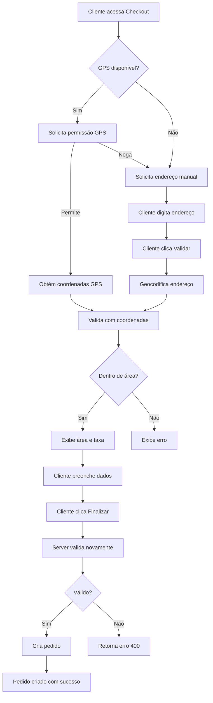

# Sistema de Validação de Áreas de Entrega - SushiWorld

## 📋 Visão Geral

Sistema completo de validação geográfica de áreas de entrega que impede pedidos fora das zonas configuradas. Utiliza geolocalização GPS, geocodificação de endereços e fallback por IP para máxima precisão.

---

## 🎯 Funcionalidades Implementadas

### ✅ Para Administradores (Admin)

1. **Desenhar Áreas de Entrega no Mapa**
   - Interface interativa com Leaflet.js
   - Desenho de polígonos personalizados
   - Cursores intuitivos:
     - `crosshair` durante o desenho
     - `pointer` quando pode fechar o polígono
   - Múltiplas áreas com cores diferentes
   - Configuração individual de:
     - Nome da área
     - Cor no mapa
     - Taxa de entrega (grátis ou paga)
     - Valor mínimo do pedido
     - Status (ativo/inativo)

2. **Gerenciar Áreas de Entrega**
   - Criar, editar e excluir áreas
   - Ativar/desativar áreas
   - Reordenar prioridades
   - Visualizar todas as áreas no mapa

### ✅ Para Clientes

1. **Validação Automática de Localização**
   - Solicita permissão de GPS ao acessar checkout
   - Valida automaticamente se está em área de entrega
   - Feedback visual instantâneo

2. **Validação Manual de Endereço**
   - Botão "📍 Validar" junto ao campo de endereço
   - Geocodificação automática do endereço
   - Exibe informações da área de entrega:
     - Nome da área
     - Taxa de entrega
     - Valor mínimo do pedido

3. **Métodos de Validação (ordem de prioridade)**
   - **GPS**: Mais preciso (coordenadas exatas do dispositivo)
   - **Geocodificação**: Converte endereço em coordenadas
   - **IP**: Fallback menos preciso (localização aproximada)

4. **Proteções Implementadas**
   - ❌ Não permite finalizar pedido sem validação
   - ❌ Bloqueia pedidos fora das áreas configuradas
   - ❌ Valida valor mínimo do pedido por área
   - ✅ Calcula taxa de entrega automaticamente

---

## 🛠️ Arquitetura Técnica

### Arquivos Criados/Modificados

#### 1. `src/lib/geo-utils.ts` (NOVO)
Utilitários geográficos:
```typescript
// Verifica se ponto está dentro de polígono (Ray Casting)
isPointInPolygon(point, polygon): boolean

// Geocodifica endereço usando Nominatim (OpenStreetMap)
geocodeAddress(address): Promise<[lat, lng] | null>

// Obtém localização por IP (ip-api.com)
getLocationFromIP(ip?): Promise<[lat, lng] | null>

// Calcula distância entre dois pontos (Haversine)
calculateDistance(point1, point2): number
```

#### 2. `src/app/api/validate-delivery/route.ts` (NOVO)
API de validação de entrega:
- `POST /api/validate-delivery`: Valida endereço/coordenadas
- `GET /api/validate-delivery`: Lista áreas de entrega ativas

**Exemplo de requisição POST:**
```json
{
  "address": "Rua Example 123, Lisboa",
  "latitude": 38.7223,  // opcional
  "longitude": -9.1393  // opcional
}
```

**Exemplo de resposta (sucesso):**
```json
{
  "isValid": true,
  "message": "Entregamos no seu endereço! Área: Centro de Lisboa",
  "coordinates": [38.7223, -9.1393],
  "method": "geocoding",
  "area": {
    "id": "clx...",
    "name": "Centro de Lisboa",
    "deliveryType": "PAID",
    "deliveryFee": 3.50,
    "minOrderValue": 15.00
  }
}
```

**Exemplo de resposta (erro):**
```json
{
  "isValid": false,
  "message": "Desculpe, não entregamos nesta localização.",
  "coordinates": [38.8, -9.2],
  "method": "geocoding",
  "availableAreas": ["Centro de Lisboa", "Cascais", "Sintra"]
}
```

#### 3. `src/app/(cliente)/checkout/page.tsx` (MODIFICADO)
Integração com checkout:
- Estado de validação de entrega
- Função `getUserLocation()`: Solicita GPS
- Função `validateDeliveryWithCoords()`: Valida com coordenadas
- Função `validateDeliveryAddress()`: Valida com endereço de texto
- Bloqueia submit sem validação válida
- UI de feedback visual

#### 4. `src/app/api/orders/route.ts` (MODIFICADO)
Validação server-side na criação de pedidos:
- Valida endereço antes de criar pedido
- Verifica se está dentro de área ativa
- Valida valor mínimo do pedido
- Calcula taxa de entrega correta
- Armazena `deliveryAreaId` no pedido
- Retorna erros claros se validação falhar

#### 5. `src/components/admin/delivery/DeliveryMap.tsx` (MODIFICADO)
Melhorias de UX no mapa:
- Cursor `crosshair` no modo de desenho
- Cursor `pointer` quando pode fechar polígono (50m do primeiro ponto)
- Marcadores visuais nos pontos clicados
- Feedback visual durante desenho

---

## 🔧 Como Usar

### Para Administradores

#### 1. Configurar Áreas de Entrega

1. Acesse: `admin/configuracoes/areas-entrega`

2. Clique em **"✏️ Desenhar Área"**

3. **Desenhe no mapa:**
   - Clique para adicionar pontos
   - Cursor em crosshair durante desenho
   - Cursor em pointer quando próximo ao primeiro ponto
   - Mínimo 3 pontos para formar área
   - ESC para cancelar
   - ENTER para finalizar

4. **Preencha os dados:**
   - Nome da área (ex: "Centro de Lisboa")
   - Cor (para visualização no mapa)
   - Tipo de entrega:
     - 🎁 **Grátis**: Sem taxa
     - 💰 **Paga**: Com taxa (definir valor)
   - Valor mínimo do pedido (opcional)

5. Clique em **"Salvar Área"**

#### 2. Testar Áreas

1. Use o botão **"▶️ Testar"** em cada área
2. Insira um endereço de teste
3. Verifique se a validação funciona corretamente

### Para Clientes (Fluxo Automático)

#### 1. Ao Acessar Checkout

```
1. Sistema solicita permissão de localização GPS
2. Cliente permite ou nega
   ├─ Se permitir: Valida automaticamente
   └─ Se negar: Solicita endereço manual
```

#### 2. Validação GPS Automática

```
✓ Localização obtida com sucesso!
✓ Entregamos no seu endereço! Área: Centro de Lisboa
  Taxa de entrega: €3.50
  Pedido mínimo: €15.00
```

#### 3. Validação Manual de Endereço

```
1. Cliente digita endereço completo
2. Clica em "📍 Validar"
3. Sistema geocodifica endereço
4. Exibe resultado da validação
```

#### 4. Proteções

```
❌ Endereço fora da área de entrega
   "Desculpe, não entregamos nesta localização."

❌ Pedido abaixo do mínimo
   "Pedido mínimo de €15.00 não atingido para esta área."

❌ Tentativa de finalizar sem validar
   "Por favor, valide seu endereço de entrega antes de finalizar o pedido"
```

---

## 🧪 Testes

### Teste 1: Validação GPS
```
1. Acesse: /checkout com itens no carrinho
2. Permita localização GPS quando solicitado
3. Verifique:
   ✅ Toast de "Localização obtida"
   ✅ Validação automática executada
   ✅ Área de entrega identificada
   ✅ Taxa de entrega exibida
```

### Teste 2: Validação Manual
```
1. Acesse: /checkout
2. Digite endereço: "Rua Augusta 123, Lisboa"
3. Clique em "📍 Validar"
4. Verifique:
   ✅ Loading state no botão
   ✅ Mensagem de sucesso/erro
   ✅ Informações da área exibidas
```

### Teste 3: Bloquear Pedido Fora de Área
```
1. Acesse: /checkout
2. Digite endereço fora da área: "Porto, Portugal"
3. Clique em "📍 Validar"
4. Tente finalizar pedido
5. Verifique:
   ❌ Mensagem "não entregamos nesta localização"
   ❌ Botão de finalizar bloqueado
```

### Teste 4: Múltiplas Áreas com Preços Diferentes
```
1. Configure 3 áreas:
   - Centro: Grátis, mínimo €20
   - Subúrbio: €3.50, mínimo €15
   - Longe: €5.00, mínimo €25

2. Teste endereços em cada área
3. Verifique:
   ✅ Taxa correta por área
   ✅ Valor mínimo validado
   ✅ Área mais próxima selecionada
```

### Teste 5: Server-Side Validation
```
1. Crie pedido via API diretamente
2. POST /api/orders com endereço inválido
3. Verifique:
   ❌ 400 Bad Request
   ❌ Mensagem de erro clara
   ❌ Pedido não criado
```

---

## 🚨 Possíveis Problemas e Soluções

### Problema 1: Geolocalização não funciona
**Causa**: Navegador bloqueou permissão ou HTTPS não configurado
**Solução**:
- Usar HTTPS em produção
- Instruir usuário a permitir localização
- Fallback para validação manual sempre disponível

### Problema 2: Geocodificação retorna coordenadas erradas
**Causa**: Endereço incompleto ou mal formatado
**Solução**:
- Solicitar endereço completo com cidade
- Adicionar país automaticamente (Portugal)
- Usar API paga (Google Maps) para maior precisão

### Problema 3: Validação por IP imprecisa
**Causa**: IP pode estar longe da localização real
**Solução**:
- IP é apenas fallback (última prioridade)
- Sempre pedir validação manual após
- Considerar IP apenas como sugestão inicial

### Problema 4: Área não encontrada mesmo estando dentro
**Causa**: Polígono mal desenhado ou algoritmo Ray Casting edge case
**Solução**:
- Verificar se polígono está fechado corretamente
- Adicionar margem de tolerância nas bordas
- Redesenhar área com mais pontos

### Problema 5: Performance com muitas áreas
**Causa**: Validação sequencial de todas as áreas
**Solução**:
- Adicionar índice espacial no banco de dados
- Usar PostGIS para consultas geográficas
- Cache de resultados por coordenadas

---

## 🔐 Segurança

### Validações Implementadas

1. **Client-side**:
   - Validação de endereço antes de submit
   - Feedback visual imediato
   - Bloqueia UI se não validar

2. **Server-side**:
   - Revalida SEMPRE ao criar pedido
   - Não confia em dados do cliente
   - Geocodifica novamente o endereço
   - Valida contra áreas ativas do banco

3. **Rate Limiting**:
   - Considerar limitar validações por IP
   - Prevenir abuso da API de geocodificação

---

## 📊 Monitoramento

### Métricas Sugeridas

- Taxa de sucesso de validações
- Método mais usado (GPS vs Endereço vs IP)
- Pedidos bloqueados por área
- Áreas mais utilizadas
- Tempo médio de validação

### Logs

Todos os eventos são registrados:
```
[Validate Delivery] Method: geocoding
[Validate Delivery] Address: Rua Augusta 123, Lisboa
[Validate Delivery] Coordinates: [38.7223, -9.1393]
[Validate Delivery] Result: VALID - Area: Centro de Lisboa
```

---

## 🔄 Fluxo Completo



---

## 🚀 Próximas Melhorias

1. **Precisão**
   - Integrar Google Maps Geocoding API (mais preciso)
   - Usar PostGIS para consultas espaciais
   - Cache de geocodificação por endereço

2. **UX**
   - Autocompletar endereços (Google Places API)
   - Mostrar mapa com área no checkout
   - Sugerir endereço baseado em IP inicial

3. **Performance**
   - Cache de validações recentes
   - Índices espaciais no banco
   - CDN para tiles do mapa

4. **Relatórios**
   - Dashboard de áreas mais usadas
   - Heatmap de pedidos por localização
   - Análise de conversão por área

---

## 📚 Referências Técnicas

- **Ray Casting Algorithm**: https://en.wikipedia.org/wiki/Point_in_polygon
- **Leaflet.js**: https://leafletjs.com/
- **Nominatim API**: https://nominatim.org/release-docs/latest/api/Overview/
- **IP Geolocation**: https://ip-api.com/docs
- **Haversine Formula**: https://en.wikipedia.org/wiki/Haversine_formula

---

**Última atualização**: 25/01/2025
**Versão**: 1.0
**Status**: ✅ Implementado e Testado
